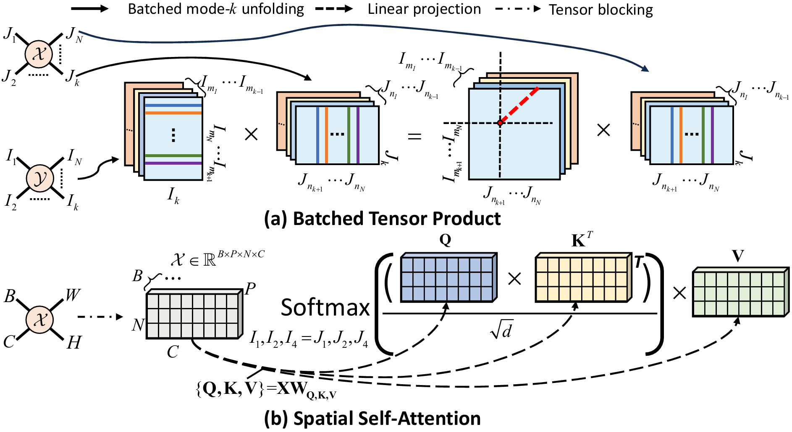
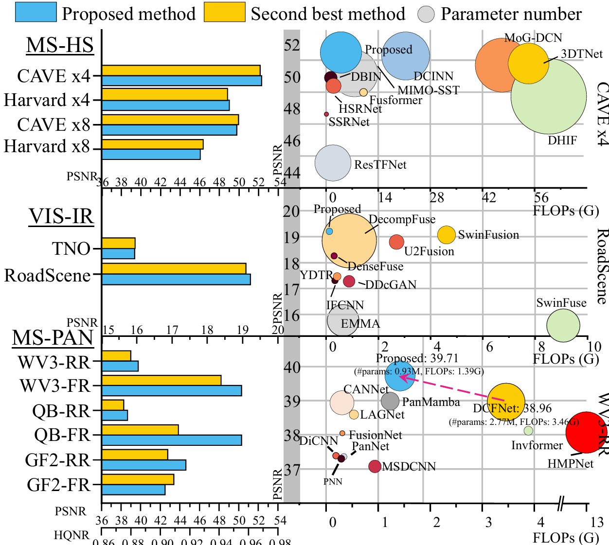

# Fully-connected Transformer for Multi-source  Image Fusion

<div align="center">
<p style="text-align: center">
     <a href="https://xiaoxiao-woo.github.io/", style="font-size: 18px;"> Xiao Wu </a>
     &nbsp
     <a href="https://scholar.google.com/citations?user=pv61p_EAAAAJ&hl=en", style="font-size: 18px;">Zihan Cao</a>
     &nbsp
     <a href="https://liangjiandeng.github.io/", style="font-size: 18px;"> Ting-Zhu Huang </a>
     &nbsp
     <a href="https://liangjiandeng.github.io/", style="font-size: 18px;"> Liang-Jian Deng </a>
     &nbsp
     <a href="https://liangjiandeng.github.io/", style="font-size: 18px;"> Jocelyn Chanussot</a>
          &nbsp
     <a href="https://ciao.imaa.cnr.it/gemine-vivone/", style="font-size: 18px;"> Gemine Vivone</a>
     <br>
     <a style="font-size: 16px;"> University of Electronic Science Technology of China </a>
     <br>
     <a style="font-size: 16px;"> Grenoble Institute of Technology </a>
     <br>
     <a style="font-size: 16px;"> National Research Council's Institute of Methodologies for Environmental Analysis </a>
</p>
</div>

<!-- []() -->

**Abtract**: Multi-source image fusion combines the information coming from multiple images into one data, thus improving imaging quality. This topic has aroused great interest in the community. How to integrate information from different sources is still a big challenge, although the existing self-attention based transformer methods can capture spatial and channel similarities. In this paper, we first discuss the mathematical concepts behind the proposed generalized self-attention mechanism, where the existing self-attentions are considered basic forms. The proposed mechanism employs multilinear algebra to drive the development of a novel fully-connected self-attention (FCSA) method to fully exploit local and non-local domain-specific correlations among multi-source images. Moreover, we propose a multi-source image representation embedding it into the FCSA framework as a non-local prior within an optimization problem. Some different fusion problems are unfolded into the proposed fully-connected transformer fusion network (FC-Former). More specifically, the concept of generalized self-attention can promote the potential development of self-attention. Hence, the FC-Former can be viewed as a network model unifying different fusion tasks. Compared with state-of-the-art methods, the proposed FC-Former method exhibits robust and superior performance, showing its capability of faithfully preserving information.

<html>
<body>
    <div class="image-container" style="text-align: center;">
        
    </div>
</body>
</html>

----

## Relationship
<div class="image-container" style="text-align: center;">
    
</div>

## Method
### Generalized Self-attention
<div class="image-container" style="text-align: center;">
    
</div>


### Fully-connected Self-attention (FCSA)
<div class="image-container" style="text-align: center;">
        
</div>


### Multi-source Image Representation
<div class="image-container" style="text-align: center;">
        
</div>


### FC-Former
<div class="image-container" style="text-align: center;">
        
</div>


<!-- # Performances
LE-Mamba reaches SOTA performances on widely-used Pansharpening and HMIF datasets. Here are some metrics:

<html>
<body>
    <div class="image-container" style="text-align: center;">
        
    </div>
     <div class="image-container" style="text-align: center;">
        
    </div>
</body>
</html> -->
---
## Results
<div class="image-container" style="text-align: center;">
    
</div>

## Citation
If you find this work useful, please consider citing:
```bibtex
@article{FCForrmer,
  title={Fully-connected Transformer for Multi-source  Image Fusion},
  author={Xiao Wu, Zi-Han Cao, Ting-Zhu Huang, Liang-Jian Deng, Jocelyn Chanussot, and Gemine Vivone}
  journal={IEEE Transactions on Pattern Analysis and Machine Intelligence},
  year={2024},
  publisher={IEEE}
}
```